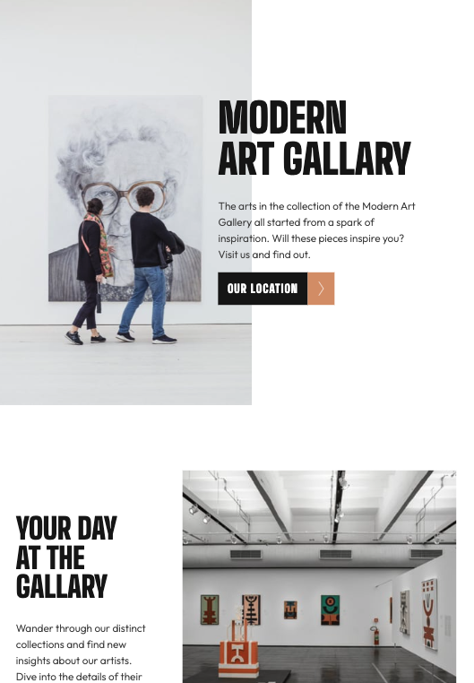

# Frontend Mentor - Art gallery website solution

This is a solution to the [Art gallery website challenge on Frontend Mentor](https://www.frontendmentor.io/challenges/art-gallery-website-yVdrZlxyA). Frontend Mentor challenges help you improve your coding skills by building realistic projects.

## Table of contents

- [Overview](#overview)
  - [The challenge](#the-challenge)
  - [Screenshot](#screenshot)
  - [Links](#links)
- [My process](#my-process)
  - [Built with](#built-with)
  - [What I learned](#what-i-learned)
  - [Continued development](#continued-development)
  - [Useful resources](#useful-resources)
- [Author](#author)
- [Acknowledgments](#acknowledgments)

## Overview

### The challenge

Users should be able to:

- View the optimal layout for each page depending on their device's screen size
- See hover states for all interactive elements throughout the site
- **Bonus**: Use [Leaflet JS](https://leafletjs.com/) to create an interactive location map with custom location pin

### Screenshot





### Links

- Solution URL: [solution URL](https://github.com/btebe/art-gallary-web)
- Live Site URL: [live site URL](https://btebe.github.io/art-gallary-web/src/)

## My process

### Built with

- Semantic HTML5 markup
- CSS custom properties
- Flexbox
- CSS Grid
- Mobile-first workflow

### What I learned

Nothing new in this project. It's everything i have come acrossed before. The layout challenge in this project was very interesting though and i found a way to change svg color in img.

To see how you can add code snippets, see below:

```css
.footer-section > div > ul > li:hover > a > img {
  filter: invert(0.21) sepia(1) saturate(7) hue-rotate(302.4deg) brightness(0.86);
}
```

### Continued development

I want to continue to make layouts for more compplex designs.

### Useful resources

- [Example resource 1](https://css-tricks.com/the-many-ways-to-change-an-svg-fill-on-hover-and-when-to-use-them/#:~:text=Target%20the%20.,hover%20state%20to%20swap%20colors.&text=This%20is%20by%20far%20the,hover%20state%20to%20an%20SVG.) - this helps to change your svg to the color you want.

## Author

- Website - [Basma tebe](https://basma94tebe.wixsite.com/my-site)
- Frontend Mentor - [@btebe](https://www.frontendmentor.io/profile/btebe)

## Acknowledgments

I would like to give my thanks to the web for making everything more accessible.
